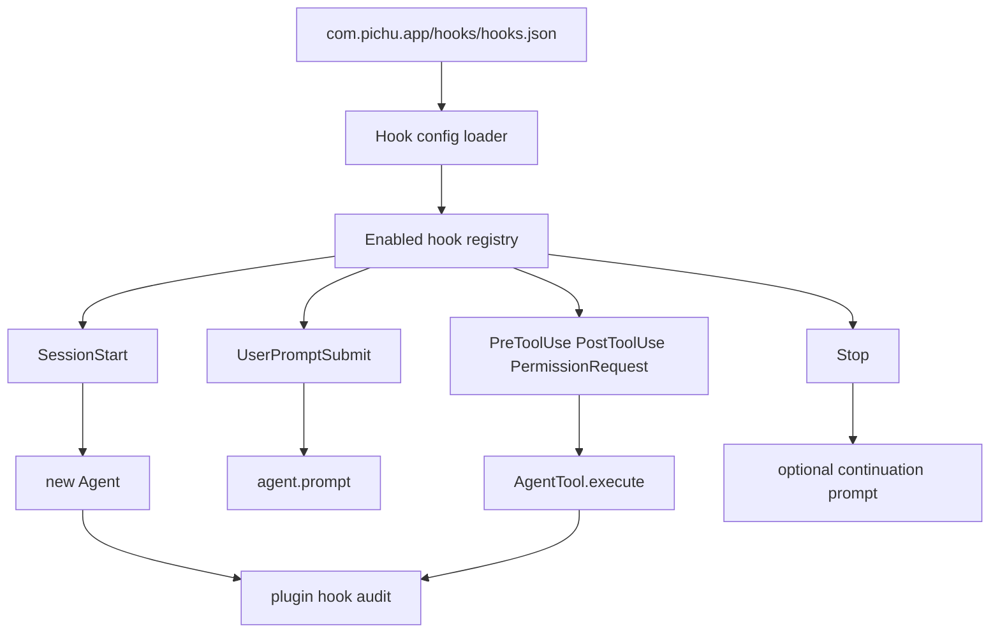
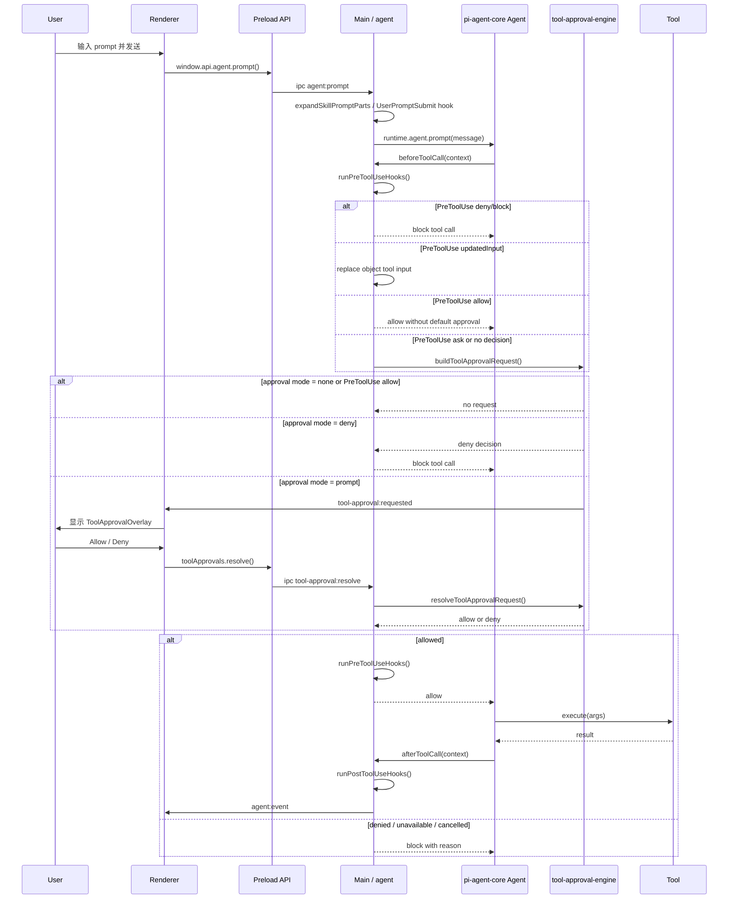

# Pichu Plugin Agent Hooks Design

## 背景

Pichu Client 采用 Agent Plugins 1.0 作为 portable plugin package 规范。该规范的
portable core 只包含 `skills/` 和根目录 `mcp.json`；Pichu hooks 属于 Pichu client
extension，固定放在 `com.pichu.app/hooks/hooks.json`。它不是 Pi CLI
Extension，也不通过 Pi Coding Agent 执行。Codex hooks 是一个命令型 agent loop
扩展机制，允许在 session、prompt、tool、permission 和 stop 等阶段运行外部 hook。

本文档给出 Pichu Client 对齐 Codex agent 执行 hooks 的设计方案。目标是
复用 Codex 插件作者熟悉的配置模型，同时保持 Pichu 的插件启用、路径安全、
权限审批、审计和主进程边界。

## 目标

- 分阶段对齐 Codex 当前公开的 hook 事件名、配置形态和 wire format。
- 支持 Agent Plugin 的 `com.pichu.app` extension 声明 lifecycle config，并在
  plugin installed 且 enabled 时进入 Pichu hook runtime。
- 在 agent session、用户 prompt、tool execution 和 stop 阶段提供明确拦截点。
- 所有 hook 执行都可审计、可取消、可诊断，并可通过内部总闸显式关闭。
- 保持 renderer 无通用 shell、文件系统或插件 registry 原语暴露。

## 非目标

- 不在首版支持任意未声明脚本执行。
- 不把 hook runtime 作为绕过未来统一工具审批/权限拦截层的权限通道。
- 不承诺 Phase 1/2 就达到完整 Codex runtime parity；Phase 1 只解析和展示，
  Phase 2 只做核心 runtime preview，Phase 3 先落统一工具审批/权限拦截层，
  Phase 4 再接入 `PermissionRequest`、工具别名和 canonical tool parity，
  Phase 5 覆盖所有 agent 构造点和企业治理能力。
- 不承诺一开始覆盖所有 Codex 内部工具名；先覆盖 Pichu `AgentTool` 面，再补齐
  `exec_command`、apply_patch、MCP 风格 canonical matcher。
- 不通过环境变量开启运行时能力。开关应走 persisted settings 或插件管理 UI。

## Codex 对齐事件

Codex 当前公开文档一共有 6 个 hook 事件。Pichu 首批应完整识别这 6 个事件名；
runtime 执行能力按下方 phase 逐步开放，不能在 Phase 1/2 对外宣称完整 parity：

| Event | Pichu 接入点 | 说明 |
| --- | --- | --- |
| `SessionStart` | `createAgentRuntime(...)` | 新建、恢复或清空 session 后运行，可追加 developer context。 |
| `UserPromptSubmit` | `ensureSessionAndPrompt(...)` / `runDetachedSessionPrompt(...)` | 用户 prompt 送入 agent 前运行，可阻断或追加上下文。 |
| `PreToolUse` | pi-agent `beforeToolCall` | 工具执行前运行，可阻断工具调用。 |
| `PermissionRequest` | 统一工具审批/权限拦截层 | 工具即将请求审批时运行，可 allow、deny 或交给默认审批。 |
| `PostToolUse` | pi-agent `afterToolCall` | 工具执行后运行，可追加上下文或替换工具结果。 |
| `Stop` | `agent.prompt(...)` / continuation 结束后 | 一轮停止前运行，可结束或发起有限次数 continuation prompt。 |

旧文档中提到的 `SessionEnd` 不作为公开 Codex 对齐事件。若已有内部需求，可在
内部映射到 `Stop`，但插件作者面向 Codex 事件名写配置。

对齐层级定义：

- Parse parity：识别 Codex 标准配置形态、事件名、matcher group 和 command
  handler，并能展示 validation diagnostics；不执行 hook。
- Runtime preview：插件 installed 且 enabled 时执行核心事件；允许存在清晰记录的
  非 parity 缺口。
- Runtime parity：覆盖 Codex 当前公开事件的触发时机、输入字段、输出解释、
  matcher、并发执行、聚合规则和失败语义。

## 未来兼容项

Codex 当前只有上述 6 个公开 hook 事件。未来 Pichu 需要预留两类扩展：一类是
Codex 已经在 wire format 中解析但暂未完全实现的字段和行为；另一类是 Pichu
自己的 agent runtime 后续会暴露的生命周期点。

Codex 行为兼容项：

- `PreToolUse.updatedInput`：允许 hook 修改工具输入；Pichu 当前支持 object tool input
  的原地替换。
- `PreToolUse.additionalContext`：未来可能允许工具执行前向模型追加上下文；当前解析但
  fail-open。
- `PreToolUse.permissionDecision: "allow" | "ask"`：支持显式放行或转审批；
  `allow` 只跳过 hook 自己发起的审批，不跳过工具自身声明的 `prompt` 或 `deny`
  审批策略；`ask` 强制进入 approval request 流程。
- `PermissionRequest.updatedPermissions`：未来可能让 hook 调整权限请求；当前应
  fail-closed。
- `PermissionRequest.interrupt`：未来可能中断审批流；当前应 fail-closed。
- `PostToolUse.updatedMCPToolOutput`：目标允许 hook 在 MCP tool result 返回模型前提出
  更新；最终结果仍由 Pichu 进行 schema、size 和 sensitive-data 校验。MCP runtime
  接入前只解析，不应用。
- `suppressOutput`：多个事件已解析该字段，但 Codex 当前未实现输出隐藏。
- Managed hooks：`requirements.toml`、`managed_dir`、`windows_managed_dir` 和企业
  下发脚本目录。
- Subagent metadata：Codex 社区已有诉求，希望 hook input 能区分 main agent 和
  subagent；Pichu 应预留 `agent_id`、`agent_type`、`parent_session_id` 等字段。
- Unified shell execution：Codex 文档提到新的 shell 执行路径仍未完整接入
  `PreToolUse` / `PostToolUse`；Pichu 后续应统一 `exec_command`、apply_patch、MCP
  和原生工具的拦截面。

Pichu 运行时扩展项：

- `SessionEnd`：内部生命周期可继续保留，但不作为 Codex 公开事件名；需要时映射到
  `Stop` 或作为 Pichu-only extension。
- Context compaction lifecycle：在 `transformContext(...)` / compaction 前后观察或追加
  context，但不应混入 Codex 6 个公开事件。
- Config/file watcher lifecycle：插件配置或工作区文件变化时触发 background hook，
  需要独立权限和节流策略。
- MCP server lifecycle：MCP server start、stop、crash、auth failure、capability
  change 和 tool exposure 事件，由 `docs/PLUGIN_SYSTEM.md` 的 MCP manager 提供；
  hook lifecycle 在 MCP runtime 稳定后开放。
- App connector lifecycle：OAuth/connect/disconnect/token refresh 等事件，应等 token
  storage 和 consent model 完整后再开放。
- Agent/subagent lifecycle：team agent、admin explore agent、plugin-provided agent
  创建和结束时的事件，应在所有 `new Agent(...)` 构造点统一接入后开放。

## 配置模型

Agent Plugins 的 root `plugin.json` 是 closed portable manifest，不能添加 top-level
`hooks`。Pichu 只从 client-extension fixed path 发现 hooks：

```text
<plugin-root>/com.pichu.app/hooks/hooks.json
```

文件缺失表示该 plugin 没有 Pichu hooks，不是错误。路径必须在 filesystem-resolved
plugin root 内；symlink、junction 或 reparse point 逃逸会禁用该 hook component。

Pichu 不再从 legacy `.open-plugin/plugin.json`、`manifest.raw.hooks`、inline manifest
object 或 `./hooks/hooks.json` 加载 hooks。目标类型为：

```ts
type AgentHookConfig = {
  hooks?: Partial<Record<AgentHookEventName, AgentHookMatcherGroup[]>>
}

type AgentHookMatcherGroup = {
  matcher?: string
  hooks: AgentCommandHook[]
}

type AgentCommandHook = {
  type: 'command'
  command: string
  timeout?: number
  statusMessage?: string
}
```

JSON 文件内容应优先支持 Codex 标准形态：

```json
{
  "hooks": {
    "PreToolUse": [
      {
        "matcher": "exec_command",
        "hooks": [
          {
            "type": "command",
            "command": "python3 ./hooks/pre_tool_use.py",
            "timeout": 30,
            "statusMessage": "Checking command"
          }
        ]
      }
    ]
  }
}
```

## Runtime 架构

新增 main-process only 的 hook runtime，位于插件系统边界内：



建议新增模块：

- `apps/pichu-client/src/main/plugins/hooks/hook-types.ts`
- `apps/pichu-client/src/main/plugins/hooks/hook-config-loader.ts`
- `apps/pichu-client/src/main/plugins/hooks/hook-runner.ts`
- `apps/pichu-client/src/main/plugins/hooks/tool-wrapper.ts`
- `apps/pichu-client/src/main/plugins/hooks/hook-audit.ts`

现有接入文件：

- `apps/pichu-client/src/main/plugins/plugin-types.ts`
- `apps/pichu-client/src/main/plugins/manifest-loader.ts`
- `apps/pichu-client/src/main/plugins/plugin-validator.ts`
- `apps/pichu-client/src/main/plugins/plugin-registry.ts`
- `apps/pichu-client/src/main/tools/index.ts`
- `apps/pichu-client/src/main/agent/index.ts`
- `apps/pichu-client/src/main/multi-agent/team-manager.ts`
- `apps/pichu-client/src/main/admin/explore-agent.ts`

## Hook 输入输出

每个 command hook 通过 stdin 接收 JSON object。公共字段对齐 Codex：

- `session_id`
- `transcript_path`
- `cwd`
- `hook_event_name`
- `model`

Turn-scoped 事件额外包含：

- `turn_id`

Tool-scoped 事件额外包含：

- `tool_name`
- `tool_use_id`
- `tool_input`
- `tool_response`，仅 `PostToolUse`。

`SessionStart` 输入额外包含：

- `source`: `startup | resume | clear`

`SessionStart` 输出支持：

- plain text stdout：作为 extra developer context。
- JSON stdout：支持 common output fields。
- `hookSpecificOutput.hookEventName: "SessionStart"`
- `hookSpecificOutput.additionalContext`

`UserPromptSubmit` 输入额外包含：

- `prompt`

`UserPromptSubmit` 输出支持：

- plain text stdout：作为 extra developer context。
- JSON stdout：支持 common output fields。
- `hookSpecificOutput.hookEventName: "UserPromptSubmit"`
- `hookSpecificOutput.additionalContext`
- legacy `decision: "block"` + `reason` 阻断本轮 prompt。
- exit code `2` + stderr 阻断本轮 prompt。

`Stop` 输入额外包含：

- `stop_hook_active`
- `stop_hook_continuation_count`
- `stop_hook_max_continuations`
- `last_assistant_message`

`Stop` 输出支持：

- `continue`
- `stopReason`
- `systemMessage`
- `suppressOutput`，先解析但不实现输出隐藏。
- `continue: false` 优先结束，不触发 continuation。
- legacy `decision: "block"` + `reason` 触发一次 continuation prompt。
- exit code `2` + stderr 触发一次 continuation prompt。
- 每个 turn 最多由 `Stop` hook 自动 continuation 三次，避免无限循环。

`Stop` exit code `0` 时 stdout 必须是 JSON。plain text stdout 对 `Stop` 是无效输出，
应作为 hook failure 处理，按当前 fail-open 策略不触发 continuation。

`PreToolUse` 支持：

- plain text stdout 忽略。
- `hookSpecificOutput.permissionDecision: "deny"`
- `hookSpecificOutput.permissionDecisionReason`
- legacy `decision: "block"` + `reason`
- exit code `2` + stderr 作为阻断原因

`PreToolUse.updatedInput` 会替换后续工具输入；`PreToolUse.permissionDecision:
"allow" | "ask"` 会影响审批流。`allow` 不覆盖工具定义的 first-party approval
metadata；工具自身声明 `prompt` 或 `deny` 时仍按工具策略进入审批或阻断。
`PreToolUse.additionalContext` 仍只解析但不改变执行流。

Pichu 扩展 `PreToolUse.approvalUi`，允许 hook 在强制进入审批时提供结构化审批视图。
该字段不是 Codex parity 字段；它只影响 Pichu renderer 中审批卡片的展示，不参与
allow/deny 决策本身。`approvalUi` 目前支持：

```json
{
  "renderer": "json-render",
  "spec": {
    "root": "root",
    "elements": {
      "root": {
        "type": "CodeBlock",
        "props": {
          "code": { "$state": "/toolInput/command" }
        },
        "children": []
      }
    }
  }
}
```

`spec` 使用受控的 json-render 子集。renderer state 固定提供 `toolName`、`cwd`、
`toolInput`、`args` 和 `exec_command` 的 `parsedCommand`，插件也可以通过
`approvalUi.state` 提供额外结构化数据。插件可以通过 `$state` 引用这些数据来渲染
命令、diff、表格、嵌套 JSON 或 key-value 摘要。Pichu 会校验 component allowlist、
元素数量、children 数量和危险 props；非法 spec fail-open 到默认 JSON 参数预览，不
阻断工具审批流程。

`parsedCommand` 是 `exec_command` shell command 的 best-effort argv 解析结果，只承诺 shell token
级别，不解释 example-db、git、npm 等具体命令的业务语义：

```json
{
  "parseStatus": "parsed",
  "command": "example-db table create --ttl 30 --fields '[{\"name\":\"a\"}]'",
  "argv": [
    "example-db",
    "table",
    "create",
    "--ttl",
    "30",
    "--fields",
    "[{\"name\":\"a\"}]"
  ],
  "executable": "example-db",
  "arguments": ["table", "create", "--ttl", "30", "--fields", "[{\"name\":\"a\"}]"]
}
```

命令专用的 flag 解释和 JSON flag 展开仍应由对应 tool 或 plugin hook 写入
`approvalUi.state`，renderer 只负责展示。

`PermissionRequest` 支持：

- 只在工具即将请求审批时触发；无需审批的工具调用不触发。
- plain text stdout 忽略。
- `tool_input.description` 可携带人类可读的审批原因。
- `hookSpecificOutput.decision.behavior: "allow" | "deny"`
- deny message
- `updatedInput`、`updatedPermissions` 和 `interrupt` 为保留字段，出现时 fail-closed。

`PostToolUse` 支持：

- plain text stdout 忽略。
- `continue: false`
- legacy `decision: "block"` + `reason`
- `hookSpecificOutput.additionalContext`
- exit code `2` + stderr 作为 feedback

`PostToolUse` 在工具已经执行后运行，不能撤销 `exec_command`、apply_patch 或 MCP tool 已产生的
副作用。`continue: false`、legacy block 或 exit code `2` 只替换继续交给模型处理的
tool result。`exec_command` 等工具非零退出后仍应触发 `PostToolUse`，并把退出状态或 error
summary 放入 `tool_response`。

## Matcher 和聚合规则

Matcher 使用 regex string。实现时先处理 `*`、`""` 或省略 matcher 为全匹配，再编译
其他 matcher 为 regex。regex 编译失败应产生 validation diagnostic，并在 runtime
跳过该 matcher group；不能导致插件加载或 agent turn 崩溃。

支持的 matcher 语义：

- `SessionStart`：匹配 `startup | resume | clear`。
- `PreToolUse` / `PermissionRequest` / `PostToolUse`：匹配 canonical tool name
  和别名。
- `UserPromptSubmit` / `Stop`：解析 matcher 但忽略，保持 Codex 行为。

工具别名：

- `exec_command` 工具匹配 `exec_command`。
- patch/edit/write 类工具匹配 `apply_patch`、`Edit`、`Write`。
- Agent Plugin MCP 工具匹配
  `mcp__<plugin-name>__<server-name>__<tool-name>`。
- 其他 Pichu 原生工具默认匹配 `tool.name`。

同一事件下多个匹配 command hooks 并发启动。聚合规则：

- 启动后，一个 hook 的结果不能阻止其他已匹配 hook 启动。
- `PermissionRequest` 中任一 deny 胜出；否则 allow 只能放行由 hook 强制 `ask`
  产生的审批；工具自身声明的 `prompt` 或 `deny` 仍按工具策略处理。无决策时走默认审批。
- `PreToolUse` 中任一 deny/block 胜出，不调用原工具。
- `PostToolUse` 中任一 `continue: false` 或 block 会替换原始工具结果。
- `Stop` 中任一 `continue: false` 优先于 continuation。
- 追加上下文按插件名、事件名、matcher group index、hook index 稳定排序。

## 安全策略

- Hook execution 由插件安装状态、插件启用状态和 hook 声明校验共同决定；没有全局关闭
  hook execution 的 persisted setting。
- 仅执行已安装且 enabled 的插件 hooks。
- 所有相对路径必须以 `./` 开头，不能逃逸插件 root。
- 首版只允许插件包内相对命令或通过 bundled Node/Python 可解析的命令；绝对路径
  命令留给 managed hooks 阶段。
- Command hook 通过当前系统用户的 login shell 执行；无法解析 login shell 时才 fallback
  到 `/bin/sh`。
- 子进程 cwd 使用 session cwd，但脚本路径解析必须基于插件 root。
- 默认 timeout 对齐 Codex：600 秒；插件可声明更短 timeout。
- agent cancel、session dispose、app quit 时必须中止 hook 子进程。
- Hook stdout/stderr、prompt、tool input/output 写审计前需要做长度限制和敏感信息
  脱敏，避免泄露 token、cookie、完整私有路径或大 payload。
- 无效 JSON、非零退出码、timeout 默认 fail-open；明确 block/deny 或 managed
  policy 才 fail-closed。

## 审计和 UI

审计事件应记录：

- plugin id、version、source、hook event name。
- matcher、command hash 或相对路径、timeout。
- start/end timestamp、duration、exit code、timeout/cancel 状态。
- parsed decision：allow、deny、block、continue、additionalContext。
- sanitized error summary。

Renderer 插件详情页应展示：

- hooks capability 是否存在。
- 支持的事件列表。
- 每个事件的 matcher group 数量和 command 数量。
- 当前 hooks active/inactive 状态由插件是否 installed 且 enabled 决定。
- 最近执行状态和 validation diagnostics。

审批 UI 渲染规则：

- Pichu 固定渲染工具名、cwd、审批说明和 allow/deny 操作，不允许插件覆盖审批按钮
  或最终决策交互。
- 插件只能通过 `approvalUi` 渲染“帮助用户审阅参数”的内容区域。
- 首版只支持 `renderer: "json-render"`，实现集中在独立 renderer 组件中，避免把
  复杂布局逻辑塞进 message list 或 approval engine。
- 支持的组件为 `Stack`、`Grid`、`Section`、`Card`、`Tabs`、`Accordion`、
  `Heading`、`Text`、`Image`、`Link`、`Badge`、`Callout`、`KeyValue`、`JsonTree`、
  `CodeBlock`、`Diff`、`DataTable` 和 `Divider`。
- `Image` 只渲染 `http:`、`https:` 和 `data:image/*` source；`Link` 只渲染
  `http:` 和 `https:` URL，其他 scheme 会降级为不可点击文本。
- 禁止 `className`、`style`、`asChild`、事件 handler、`on`、`watch` 和 `repeat`，避免
  插件绕过审批 UI 的安全边界。

## Phase 0: 文档和契约校准

目标：先把 Pichu 对外承诺、Codex parity 边界和实现分期写清楚，避免 parse-only
阶段被误解为 runtime parity。

详细 todos：

- [x] 明确 6 个 Codex 公开事件是必须识别的事件名，但 runtime 按 phase 开放。
- [x] 定义 parse parity、runtime preview 和 runtime parity 的含义。
- [x] 拆开 `SessionStart`、`UserPromptSubmit`、`Stop` 的输出语义。
- [x] 明确 `Stop` exit code `0` 时 plain text stdout 无效。
- [x] 明确 `PermissionRequest` 只在即将请求审批时触发。
- [x] 明确 `PostToolUse` 不能撤销工具副作用，只能替换模型看到的工具结果。
- [x] 明确 matcher 编译失败只产生 diagnostic，不中断插件加载或 agent turn。
- [x] 更新 `docs/PLUGIN_SYSTEM.md`，将 hooks 章节指向本文档并说明分阶段状态。
- [x] 运行 `git diff --check`。

## Phase 1: Legacy Parse Baseline 和 Agent Plugins Migration

目标：让 Pichu 能理解 Codex hooks 配置，但不执行 hooks。

下面的 legacy parse baseline 已被 Agent Plugins migration 取代。当前实现已经删除
manifest inline hooks、string path、array declaration 和默认 `./hooks/hooks.json`
discovery；portable root `plugin.json` 不允许这些 top-level fields。

详细 todos：

- [x] 定义 `AgentHookEventName` union：`SessionStart`、`UserPromptSubmit`、
  `PreToolUse`、`PermissionRequest`、`PostToolUse`、`Stop`。
- [x] 定义 hook config、matcher group、command hook、derived declaration、
  validation diagnostic 类型。
- [x] 使用 derived hook declarations，让 runtime 不依赖 raw manifest fields。
- [x] 删除 manifest `hooks` string、array 和 inline object loader。
- [x] 只发现 `./com.pichu.app/hooks/hooks.json`。
- [x] 对 hook config 文件执行现有插件路径安全检查。
- [x] 校验事件名，只允许 Codex 对齐事件。
- [x] 校验 hook handler `type`，首版只允许 `command`。
- [x] 校验 `command` 非空字符串。
- [x] 校验 `timeout` 为正数，缺省值记录为 600 秒。
- [x] 校验 `statusMessage` 为可选字符串。
- [x] 校验 `matcher` 为可选字符串；`*`、空字符串和省略 matcher 记录为全匹配。
- [x] 对非空非 `*` matcher 尝试 regex 编译，失败时记录 warning diagnostic 并跳过
  该 matcher group 的 runtime eligibility。
- [x] 将解析后的 hook summary 加入 validator result 或 derived capability result。
- [x] 保持 `ACTIVE_COMPONENTS` 不包含 `hooks`，执行状态仍为 inactive。
- [x] 更新插件详情 UI，展示 hooks capability、事件、matcher、command 数量。
- [x] 插件详情 UI 必须展示 Phase 1 状态：配置可识别，但不会执行。
- [x] 更新 plugin creator reference，说明 Pichu 支持 Codex shape 但 Phase 1 不执行。
- [x] 更新 `docs/PLUGIN_SYSTEM.md` 的 hook 章节，指向本文档。
- [x] 扩展 `plugin-system.test.mjs`，覆盖 valid `hooks.json`。
- [x] 增加 invalid event、invalid handler type、invalid timeout、missing file 测试。
- [x] 增加 default `./hooks/hooks.json` discovery 测试。
- [x] 增加 inline object 和 array declaration 测试。
- [x] 增加 invalid matcher regex diagnostic 测试。
- [x] 运行 `pnpm --filter pichu-client test:plugins`。
- [x] 运行 `pnpm --filter pichu-client typecheck:node`。

Agent Plugins target todos：

- [ ] 只从 `<plugin-root>/com.pichu.app/hooks/hooks.json` 发现 Pichu hooks。
- [ ] 使用 Agent Plugins filesystem-resolved root 执行 containment 检查。
- [ ] 删除 `NormalizedPluginManifest.hooks` 和 `manifest.raw.hooks` runtime dependency。
- [ ] 删除 manifest inline object、array 和 `./hooks/hooks.json` fallback discovery。
- [ ] 保留现有 `AgentHookConfig` 内容 schema、event validation 和 matcher diagnostics。
- [ ] 更新 plugin details UI，标记 hooks 为 `com.pichu.app` client extension。
- [ ] 增加 portable skills、MCP servers 和 Pichu hooks 互相独立的 failure-boundary tests。

## Phase 2: Core Runtime Preview 默认开启

目标：插件 installed 且 enabled 后默认执行核心 hook 事件，覆盖主 chat 和 detached
session runtime。
本阶段不声明完整 Codex parity；`PermissionRequest` 可继续保持 parse-only，除非统一
工具审批/权限拦截层已经落地。

详细 todos：

- [x] 不提供全局 hook execution 开关，避免关闭安全类 hooks；执行边界由插件安装、
  插件启用和 hook 声明校验控制。
- [x] Hook execution 跟随插件 installed/enabled 状态，不增加插件级二次开关。
- [x] 实现 `hook-runner.ts`，通过 child process 执行 command hook。
- [x] 为 runner 增加 timeout、AbortSignal、cwd、stdin JSON、stdout/stderr capture。
- [x] 实现 stdout JSON parser，支持空 stdout 成功。
- [x] 实现 plain text handling：仅 `SessionStart` 和 `UserPromptSubmit` 作为 extra
  developer context；`Stop` plain text 视为 invalid output。
- [x] 实现 exit code `2` handling：按事件解释为 block、deny 或 continuation。
- [x] 实现 hook result aggregation。
- [x] 实现 hook audit event 写入。
- [x] 在 `plugin-registry.ts` 提供 enabled hook configs 查询接口。
- [x] 在 `createAgentRuntime(...)` 接入 `SessionStart`。
- [x] 将 `SessionStart` plain text 或 additional context 追加到本 session 的 developer
  context。
- [x] 在 `ensureSessionAndPrompt(...)` 接入 `UserPromptSubmit`。
- [x] 在 `runDetachedSessionPrompt(...)` 接入 `UserPromptSubmit`。
- [x] User prompt 被 block 或 exit code `2` 时返回稳定错误，不调用 `agent.prompt(...)`。
- [x] 通过 pi-agent `beforeToolCall` / `afterToolCall` 接入工具 hook。
- [x] `PreToolUse` block 时不调用原始 `execute`。
- [x] `PostToolUse` block 或 `continue: false` 时替换原始 tool result。
- [ ] `PostToolUse` 必须保留审计中的原始 tool result summary，但不能把原始结果继续交给
  模型。
- [x] 保证原工具异常仍能进入 `PostToolUse`，并把 error summary 放入
  `tool_response`。
- [x] 为 `AgentToolResult` 构造统一 hook feedback 文本。
- [x] 为 tool hook 增加工具名别名映射。
- [x] 在 `agent.prompt(...)` 和 `continueQueuedAgentMessages(...)` 完成后接入 `Stop`。
- [x] 实现 `Stop` continuation，一轮最多三次。
- [x] `Stop` 中任一 `continue: false` 优先于所有 continuation 决策。
- [ ] 将 hook cancel 连接到 session dispose、agent abort 和 app shutdown。
- [ ] 在 renderer 显示最近 hook 执行状态。
- [ ] 增加 runner 单测：success、invalid JSON、Stop plain text invalid、exit 2、
  timeout、abort、stderr。
- [x] 增加 wrapper 单测：Pre block、Post replace。
- [ ] 增加 wrapper 单测：原工具异常。
- [ ] 增加 integration fixture plugin，验证 prompt block、tool block、Post replace 和
  Stop continuation。
- [x] 将测试 hooks plugin 放入 `resources/internal-plugins` 内测 marketplace，beta 包可安装，
  stable 包不打包。
- [x] 运行 `pnpm --filter pichu-client test:plugins`。
- [x] 运行 `pnpm --filter pichu-client typecheck:node`。
- [ ] 手动验证 chat session：启用测试插件后 prompt hook 能追加 context。
- [ ] 手动验证 tool hook：测试工具被 block 时 UI 和 transcript 可读。

## Phase 3: Approval Engine Foundation

目标：先把工具审批/权限拦截抽成统一 main-process 边界，让工具定义自己声明是否需要
approval，approval engine 只消费 request/decision，不通过 tool name 猜测风险类型。
后续 `PermissionRequest` 会在“工具即将请求审批”时接入这个边界。

当前执行流程：

用户在 renderer 输入 prompt 后，经 preload 的 `window.api.agent.prompt(...)` 调用
main process 的 `agent:prompt` IPC。main 侧恢复或创建 session runtime，展开 skill
prompt，运行 `UserPromptSubmit` hook，设置 session 为 running，然后调用
`runtime.agent.prompt(...)`。当模型发起 tool call 时，pi-agent 会先进入
`beforeToolCall`。Pichu 在这里先执行 `PreToolUse` hook：`deny/block` 直接阻断，
`updatedInput` 替换后续 object tool input，`permissionDecision: "allow"` 只跳过
hook-only approval，`permissionDecision: "ask"` 强制进入 approval request。随后 approval
gate 根据 tool-defined metadata 或 hook 的 `ask` 决策创建 pending request，通过 main
注入的 `eventSender` 发送 `tool-approval:requested` 给 renderer，等待
`ToolApprovalOverlay` 的 allow/deny 决策。approval 放行后 tool 才真正执行。tool 执行
结束后再进入 `PostToolUse` hook，并将 agent event 持久化和转发给 renderer。

```mermaid
flowchart TD
  A[用户在 renderer 输入 prompt] --> B[window.api.agent.prompt]
  B --> C[main IPC: agent:prompt]
  C --> D[恢复或创建 session runtime]
  D --> E[展开 skill prompt 和 UserPromptSubmit hooks]
  E --> F[setSessionRunState running]
  F --> G[runtime.agent.prompt(message)]

  G --> H{模型是否调用 tool?}
  H -- 否 --> Z[继续生成 assistant 输出]
  H -- 是 --> I[Agent beforeToolCall]

  I --> P[运行 PreToolUse hooks]
  P --> U{PreToolUse 输出}
  U -- deny/block --> X[block tool call]
  U -- updatedInput --> J[替换 object tool input]
  U -- allow --> V[pi-agent-core 执行 tool]
  U -- ask 或无审批决策 --> K{approval mode}
  J --> K

  K -- hook ask --> L{source 是否 chat 且 eventSender 可用?}
  K -- none 或无 metadata --> V
  K -- deny --> X
  K -- prompt --> L

  L -- 否 automation 或无 UI --> X
  L -- 是 --> M[创建 pending approval request]
  M --> N[发送 tool-approval:requested 到 renderer]
  N --> O[ToolApprovalOverlay 展示 Allow / Deny]

  O --> Q{用户选择}
  Q -- Allow --> R[tool-approval:resolve allow]
  Q -- Deny --> S[tool-approval:resolve deny]
  M --> T[保持 pending，直到用户决策或 session 取消]

  R --> V
  S --> X[beforeToolCall 返回 block]

  V --> W[afterToolCall / PostToolUse hooks]
  W --> Y[agent event 持久化并转发 renderer]
```



详细 todos：

- [x] 新增 `tool-approval-engine.ts`，定义统一 `ToolApprovalRequest`。
- [x] 新增 `tool-approval-metadata.ts`，允许工具定义注册 `approval.mode`、
  approval reason 和 description resolver。
- [x] 为工具调用构造稳定 request：session id、cwd、tool name、tool use id、
  tool input、source、description、approval mode。
- [x] 无 tool approval metadata 时默认 allow，不改变现有用户行为。
- [x] 实现 deny 决策：返回稳定 reason，并阻断工具执行。
- [x] 实现 prompt-unavailable 决策：在 renderer approval UI 未实现前 fail-closed。
- [x] 删除 approval engine 内部的 tool name/category classifier；新增工具不需要改
  approval engine。
- [x] 在主 agent runtime 的 `beforeToolCall` 接入 approval engine。
- [x] 在 detached agent runtime 的 `beforeToolCall` 接入 approval engine。
- [x] 在 human-input continuation 的手动 tool execution path 接入 approval engine。
- [x] 增加 renderer approval request queue、approve/deny IPC 和取消语义；用户审批不设置自动超时。
- [ ] 增加 approval audit event，记录 tool name、decision、duration 和 sanitized
  description。
- [ ] 将需要审批的现有工具逐个迁移为 tool-defined approval metadata。
- [ ] 把 Pichu 安装/启用策略推导出的 MCP server 与 tool permissions 转换为工具注册时
  的 approval metadata 或 `PermissionRequest` 输入，而不是读取 portable manifest
  top-level permission fields。
- [x] 为 approval prompt 增加 renderer UI，支持当前 session 内一次性 allow/deny。
- [x] 为 automation source 增加非交互策略：需要 prompt 时 fail-closed 或走组织策略。
- [x] 增加 approval engine 单测：无 metadata 默认不请求审批、tool-defined prompt、
  deny、prompt-unavailable。
- [ ] 增加 runtime path 测试：main agent、detached agent、human-input continuation。
- [x] 运行 `pnpm --filter pichu-client test:plugins`。
- [x] 运行 `pnpm --filter pichu-client typecheck:node`。
- [x] 运行 `pnpm --filter pichu-client typecheck:web`。

## Phase 4: PermissionRequest 和 Codex Tool Parity

目标：基于 Phase 3 的统一 approval engine，补齐审批事件、Codex canonical tool
names、MCP tool matcher 和审批聚合语义。

详细 todos：

- [x] 接入统一工具审批/权限拦截层，完整触发 `PermissionRequest`。
- [x] 确保 `PermissionRequest` 只在工具即将请求审批时触发，无需审批的工具调用不触发。
- [x] 为 `PermissionRequest` 输入填充 `tool_name`、`tool_input` 和可选
  `tool_input.description`。
- [x] 实现 `PermissionRequest` allow 跳过 hook-only 审批，但不绕过工具自身审批策略。
- [x] 实现 `PermissionRequest` deny 阻断审批请求并返回稳定错误。
- [x] 实现 deny 优先的多 hook 聚合；无决策时走默认审批。
- [x] `PermissionRequest` plain text stdout 必须忽略。
- [x] `PermissionRequest.updatedInput`、`updatedPermissions` 和 `interrupt` 出现时
  fail-closed，并记录 diagnostic/audit。
- [x] 补齐 `exec_command`、apply_patch、Edit、Write 的 Codex canonical name 和 matcher alias。
- [ ] MCP server runtime 接入后，补齐
  `mcp__<plugin-name>__<server-name>__<tool-name>` matcher。
- [ ] 保证 file edits 通过 `apply_patch` 报告 canonical `tool_name: "apply_patch"`。
- [x] 增加 PermissionRequest 聚合测试：deny wins、allow skips approval、no decision
  falls through。
- [ ] 增加无需审批工具不触发 PermissionRequest 的测试。
- [x] 增加 tool alias matcher 测试：`apply_patch`、`Edit`、`Write`。
- [x] 运行 `pnpm --filter pichu-client test:plugins`。
- [x] 运行 `pnpm --filter pichu-client typecheck:node`。

## Phase 5: Runtime Parity Hardening

目标：补齐更完整的 Codex 行为、企业策略和所有 agent 构造点。

详细 todos：

- [ ] 将 hook execution 从 registry/audit JSON 提升为一等 runtime record。
- [ ] 为 hook records 增加查询 API 和分页 UI。
- [x] 支持并测试 `PreToolUse.updatedInput` 修改工具输入。
- [x] 支持并测试 `PreToolUse.permissionDecision: "allow" | "ask"` 接入 approval 流程。
- [x] 支持并测试 `PreToolUse.approvalUi` 渲染结构化审批内容，首版使用受控
  json-render schema。
- [ ] MCP runtime 接入后支持并测试 `PostToolUse.updatedMCPToolOutput`，在结果返回模型
  前应用受控更新并重新校验。
- [x] 预留并测试 `suppressOutput`，在 UI/事件流支持前只解析不隐藏。
- [x] 支持 managed hooks 配置。
- [x] 支持 managed directory 和绝对路径 command 白名单。
- [ ] 增加 managed policy 的 fail-closed 配置。
- [ ] 为企业策略增加组织级 allowlist/denylist。
- [ ] 支持 hook command hash/integrity 校验。
- [ ] 为 hook input 预留 `agent_id`、`agent_type`、`parent_session_id` 等 subagent
  metadata 字段。
- [ ] 覆盖 `multi-agent/team-manager.ts` 中的 agent runtime。
- [ ] 覆盖 `admin/explore-agent.ts` 中的 agent runtime。
- [ ] 覆盖自动化 session source 的 start source 和 stop behavior。
- [ ] 为 compaction lifecycle 增加内部 extension point，但不公开为 Codex 事件。
- [ ] 为 file/config watcher 增加后续 hook lifecycle 预留接口。
- [ ] 为 MCP server lifecycle 增加后续 hook lifecycle 预留接口。
- [ ] 为 app connector lifecycle 增加后续 hook lifecycle 预留接口。
- [ ] 为 plugin-provided agent lifecycle 增加后续 hook lifecycle 预留接口。
- [ ] 增加 plugin hook execution 的 renderer diagnostics timeline。
- [x] 增加敏感信息脱敏测试。
- [ ] 增加多插件并发匹配和稳定排序测试。
- [ ] 增加 Stop continuation 防循环测试。
- [x] 增加 managed hooks policy 测试。
- [x] 增加 bundled marketplace 保护测试，确保测试 hooks plugin 不进入正式 marketplace，
  并从 internal marketplace 安装到 `internal-plugins/installed.json`。
- [x] 更新 `docs/PLUGIN_SYSTEM.md`，将 hooks 从 Post-MVP 更新为 staged runtime capability。
- [ ] 更新 release/changelog fragment，说明该能力的用户可见行为和默认开启策略。
- [x] 运行 `pnpm --filter pichu-client test:plugins`。
- [x] 运行 `pnpm --filter pichu-client typecheck:node`。
- [ ] 对跨进程或 UI 修改运行 `pnpm --filter pichu-client typecheck`。

## 验证矩阵

| Surface | Checks |
| --- | --- |
| Plugin parser | `pnpm --filter pichu-client test:plugins` |
| Main runtime | `pnpm --filter pichu-client typecheck:node` |
| Renderer UI | `pnpm --filter pichu-client typecheck:web` |
| Cross-process changes | `pnpm --filter pichu-client typecheck` |
| Docs-only updates | `git diff --check` |

## 开放问题

- Phase 2 是否只面向内置或本地开发插件开放，还是允许所有 marketplace 插件开启。
- 首版是否允许绝对 command，例如企业 MDM 安装的脚本路径。
- Hook additional context 应进入 system prompt、developer context，还是作为本轮
  transient message 注入。
- Hook audit 是否复用现有 plugin audit log，还是新增独立 runtime execution store。
