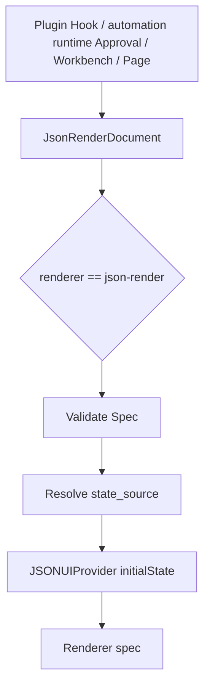

# RFC: Json Render UI Protocol

## Status

Draft technical design for extracting json-render into a shared Pichu Client UI rendering protocol.

## Abstract

Json Render 是 Pichu Client 中面向结构化 JSON 数据的通用只读 UI 渲染方案。它把“展示结构”和“展示数据”拆成两个部分：`spec` 描述 UI 树，`state_source` 提供运行时状态。调用方只需要产出一个稳定的 JSON 文件或 JSON object，renderer 就可以在 approval 上下文、automation runtime 结果页、Workbench cell 和未来插件页面中复用同一套展示能力。

核心协议：

```json
{
  "renderer": "json-render",
  "spec": {
    "root": "root",
    "elements": {
      "root": {
        "type": "Stack",
        "props": { "gap": "md" },
        "children": ["title", "summary"]
      },
      "title": {
        "type": "Heading",
        "props": { "text": { "$state": "/title" }, "level": 3 }
      },
      "summary": {
        "type": "JsonTree",
        "props": { "value": { "$state": "/summary" }, "defaultExpandedDepth": 2 }
      }
    }
  },
  "state_source": {
    "title": "Scan Result",
    "summary": {
      "status": "passed",
      "risk_count": 0
    }
  }
}
```

`renderer` 固定为 `json-render`。`spec` 使用 `@json-render/react` 的 spec 形态。`state_source` 可以是内联 JSON object，也可以是指向本地 JSON 文件的 path；文件内容解析后也必须是 JSON object。

## Motivation

当前 Pichu Client 已经在多个地方使用 json-render：

- Tool approval hook 通过 `approvalUi` 渲染结构化审批内容。
- automation runtime result UI 通过 `simple.json` 和 `detailed.json` 渲染结果卡片和详情页。
- automation runtime approval stage 需要展示面向人类确认的结构化上下文。

这些场景本质上都不是“审批专用 UI”，而是“把可信 schema 和运行时 JSON 状态渲染成受控 UI”。抽出独立协议后，可以避免每个业务面重复定义 UI JSON 格式，也能让插件、automation runtime 和未来自动化页面使用同一套组件 allowlist、安全校验和路径规则。

## Goals

- 定义一个独立的 json-render 文件 schema，作为 Pichu 内部通用 UI 渲染契约。
- 支持 `spec` 和 `state_source` 分离，允许同一个 spec 渲染不同状态。
- 支持 `state_source` 既可以是内联 JSON，也可以是本地 JSON 文件路径。
- 明确本地路径解析、安全边界、失败策略和 renderer 职责。
- 复用现有 `@json-render/react`、component registry、spec validation 和受控组件集合。

## Non-Goals

- 不把 json-render 变成任意 HTML、CSS 或脚本执行容器。
- 不允许调用方注入事件 handler、任意 class、style 或外部组件实现。
- 不在本协议内定义业务审批、表单提交、automation runtime 调度或插件权限逻辑。
- 不产出用户输入数据；需要表单输入和 submit 时使用 `form-render`，详见 `docs/RFC_FORM_RENDER.md`。
- 不把 `state_source` 设计成远程 URL、数据库查询、shell command 或动态表达式。
- 不承诺完全兼容所有 `@json-render/react` 组件；Pichu 只开放受控子集。

## Relationship To Form Render

`json-render` 和 `form-render` 必须保持边界清晰：

- `json-render`：只读展示。它可以展示表单控件样式的 preview，但这些控件不拥有 submit lifecycle，也不写回 runtime data。
- `form-render`：交互输入。它负责字段状态、校验、submit，并产出结构化 JSON。
- `approval`：决策节点。它可以用 `json-render` 展示上下文，但 approve / deny / acknowledge 按钮属于 approval 容器，不属于 json-render spec。

因此，automation runtime 中的人工暂停不再使用泛化 `human_in_the_loop` 语义，而是拆成 `approval` 和 `form_submit`。前者使用 `json-render` 展示上下文，后者使用 `form-render` 收集用户补充内容。

## Current Baseline

现有实现可复用的部分：

- Renderer 入口：`apps/pichu-client/src/renderer/src/components/approval/ApprovalJsonRender.tsx`。
- Component registry：`apps/pichu-client/src/renderer/src/components/approval/json-render-registry.tsx`。
- Spec validation：`apps/pichu-client/src/renderer/src/components/approval/json-render-validation.ts`。
- Tool approval schema：`apps/pichu-client/src/shared/tool-approval.ts`。
- automation runtime result UI snapshot：`apps/pichu-client/src/main/automation-runtime/result-ui.ts`。

当前 schema 在不同调用点里仍带有场景痕迹，例如 approval 使用 `state`，automation runtime result UI 直接把结果数据写入 `state`。本 RFC 将它统一为 `state_source`，由 json-render 协议层负责解析为 renderer state。

## Protocol Shape

### JsonRenderDocument

```ts
type JsonRenderDocument = {
  renderer: 'json-render'
  spec: JsonRenderSpec
  state_source?: JsonRenderStateSource
}

type JsonRenderStateSource = JsonRenderState | JsonStateFilePath

type JsonRenderState = Record<string, JsonValue>
type JsonStateFilePath = string
```

字段说明：

- `renderer`：固定字符串，只允许 `json-render`。
- `spec`：`@json-render/react` spec 形态，至少包含 `root` 和 `elements`。
- `state_source`：可选；省略时 renderer 使用空 object 作为 state。存在时由协议层解析成 JSON state。

`state_source` 的值有两种合法形态：

- JSON object：直接作为 renderer state，方便通过 JSON Pointer 路径引用。
- 文件路径 string：当 string 被判定为本地存在的 JSON 文件 path 时，读取并解析该文件作为 state，解析结果也必须是 JSON object。

为了避免 string state 和 path state 的语义冲突，普通字符串 state 必须包装成 object：

```json
{
  "renderer": "json-render",
  "spec": {},
  "state_source": {
    "value": "plain text state"
  }
}
```

## State Source Resolution

json-render 在接收文档后按以下顺序解析 `state_source`：

1. 如果 `state_source` 不存在，state 为 `{}`。
2. 如果 `state_source` 不是 string，校验它是 JSON object，并直接作为 JSON state。
3. 如果 `state_source` 是 string，先按当前调用点声明的 base directory 解析成本地路径。
4. 如果路径存在且是普通文件，读取文件内容，按 JSON 解析，解析结果作为 state。
5. 如果路径不存在、路径存在但不是文件、读取失败、JSON 解析失败或解析结果不是 object，该 json-render 文档无效，调用方进入对应失败策略。

路径解析必须由调用点提供安全 base directory：

- Plugin hook approval UI 的相对路径基于插件 root 或 hook 输出目录，不能逃逸插件 root。
- automation runtime result UI 的相对路径基于 flow version root，不能逃逸当前 flow 版本目录。
- 未来 data-root 页面必须基于明确的 app data root 子目录，不能解析任意绝对路径。

安全要求：

- 相对路径必须以 `./` 开头。
- 禁止 `..` 路径穿越和控制字符。
- 禁止解析 symlink 后逃逸 base directory。
- 默认不允许绝对路径；如果某个内部调用点必须支持绝对路径，需要先在该调用点 RFC 中单独说明安全边界。
- 文件大小应设置上限，避免大 JSON 阻塞 renderer 或 main process。

## Spec Contract

`spec` 直接遵循 `@json-render/react` 的 spec 形态：

```ts
type JsonRenderSpec = {
  root: string
  elements: Record<
    string,
    {
      type: string
      props?: Record<string, unknown>
      children?: string[]
    }
  >
}
```

状态引用使用 `@json-render/react` 支持的 state binding，例如：

```json
{
  "type": "Text",
  "props": {
    "text": { "$state": "/summary/title" }
  }
}
```

Pichu renderer 应继续执行受控校验：

- `root` 必须指向存在的 element。
- element 数量和 children 数量必须有限。
- component type 必须在 Pichu allowlist 内。
- 禁止 `className`、`style`、`asChild`、事件 handler、`on`、`watch` 和 `repeat`。
- 组件 props 必须通过 registry schema 校验。

首批通用组件沿用现有 registry，包括布局、文本、图片、链接、badge、callout、key-value、JSON tree、code block、diff、data table、只读控件 preview 和图表组件。Approval 或结果页可以在自己的容器外层提供业务按钮，但 json-render 内容本身不拥有业务决策交互，也不提交表单数据。

图表组件参考 shadcn charts 的 Recharts 模式，开放受控的可视化子集：

- `AreaChart`
- `BarChart`
- `LineChart`
- `PieChart`
- `RadarChart`
- `RadialChart`

Cartesian chart 共享 `data`、`xKey` 和 `series`。Polar chart 共享 `data`，并通过 `nameKey` / `valueKey` 或 `angleKey` / `series` 取值。图表颜色只允许受控 hex color 或 CSS variable，避免从 JSON 注入任意 style。

## Rendering Flow



渲染流程：

1. 调用方产出 `JsonRenderDocument`。
2. 协议层校验 `renderer` 和 `spec`。
3. 协议层把 `state_source` 解析为 JSON state。
4. Renderer 用 `JSONUIProvider` 注入 initial state。
5. `Renderer` 根据 `spec` 和 registry 渲染 UI。

## Failure Strategy

json-render 是展示协议，不应该默认改变业务执行结果。失败策略由调用点决定，但需要保持稳定：

- Tool approval：fail-open 到默认 JSON 参数预览，不能因为自定义 UI 无效而阻断审批流程。
- automation runtime result UI：保存结果时应 fail-closed，避免持久化不可渲染的结果 UI。
- automation runtime approval UI：应 fail-closed 到默认 approval 上下文或明确错误态，避免用户在缺少上下文时做决策。
- automation runtime form_submit：不使用 json-render 收集输入；表单 schema 和 submit 失败策略属于 `form-render`。
- 普通信息展示页：可以显示可诊断错误态，并保留原始 JSON 下载或预览入口。

错误信息必须可诊断但不能泄露 token、cookie、完整私有路径或大 payload。

## Example: Inline State

```json
{
  "renderer": "json-render",
  "spec": {
    "root": "root",
    "elements": {
      "root": {
        "type": "Card",
        "props": {
          "title": { "$state": "/title" },
          "description": { "$state": "/description" }
        },
        "children": ["metrics"]
      },
      "metrics": {
        "type": "KeyValue",
        "props": {
          "items": { "$state": "/metrics" }
        }
      }
    }
  },
  "state_source": {
    "title": "Flow Summary",
    "description": "Latest execution result",
    "metrics": [
      { "label": "Status", "value": "Succeeded", "format": "text" },
      { "label": "Duration", "value": "42s", "format": "text" }
    ]
  }
}
```

## Example: File State

```json
{
  "renderer": "json-render",
  "spec": {
    "root": "root",
    "elements": {
      "root": {
        "type": "JsonTree",
        "props": {
          "value": { "$state": "/" },
          "defaultExpandedDepth": 2
        }
      }
    }
  },
  "state_source": "./state/latest-result.json"
}
```

如果当前调用点的 base directory 是 `{dataRoot}/automation-results/scan-flow/1.0.0/`，则 `./state/latest-result.json` 只能解析到该目录内部。

## Example: Chart

```json
{
  "renderer": "json-render",
  "spec": {
    "root": "root",
    "elements": {
      "root": {
        "type": "AreaChart",
        "props": {
          "title": "Traffic trend",
          "description": "Daily visitors by channel",
          "data": { "$state": "/traffic" },
          "xKey": "day",
          "series": [
            { "key": "desktop", "label": "Desktop", "color": "#2563eb" },
            { "key": "mobile", "label": "Mobile", "color": "#059669" }
          ],
          "showLegend": true
        }
      }
    }
  },
  "state_source": {
    "traffic": [
      { "day": "Mon", "desktop": 186, "mobile": 80 },
      { "day": "Tue", "desktop": 305, "mobile": 200 }
    ]
  }
}
```

## Migration Notes

现有调用点可以分阶段迁移：

1. 本阶段先新增独立通用能力目录和协议类型，不改现有 approval UI 或 automation runtime result UI 的渲染调用链。
2. 保留现有 `renderer: "json-render"` 和 `spec` 校验。
3. 在通用协议层新增 `state_source` 解析能力。
4. 后续迁移 Tool approval 时，将当前 `approvalUi.state` 映射为 `state_source`，并继续注入审批固定 state，如 `toolName`、`cwd`、`toolInput`、`args` 和 `parsedCommand`。
5. 后续迁移 automation runtime result UI 时，将当前 `state` 改为 `state_source`，并允许 `simple.json` / `detailed.json` 引用独立 state 文件。
6. 后续 automation runtime `approval` stage 和插件页面只接入 `JsonRenderDocument`，不再定义场景私有只读 UI schema。
7. automation runtime `form_submit` stage 不接入 json-render submit 能力；它使用 `form-render` 产出用户补充数据。

为兼容已持久化数据，读取旧记录时可以在边界层把 `state` 转成 `state_source`。新写入的数据应使用 `state_source`。

## Open Questions

- 是否需要给 `state_source` 文件路径增加更细的错误码，区分不存在、越权、非 JSON 和非 object。
- 通用 registry 是否要拆成基础组件、审批组件、表单组件等多个 capability profile。
- 是否需要为大型 state 文件增加 lazy loading 或分页组件。
- 是否需要在插件 manifest 中声明 json-render UI capability，方便安装前校验。
