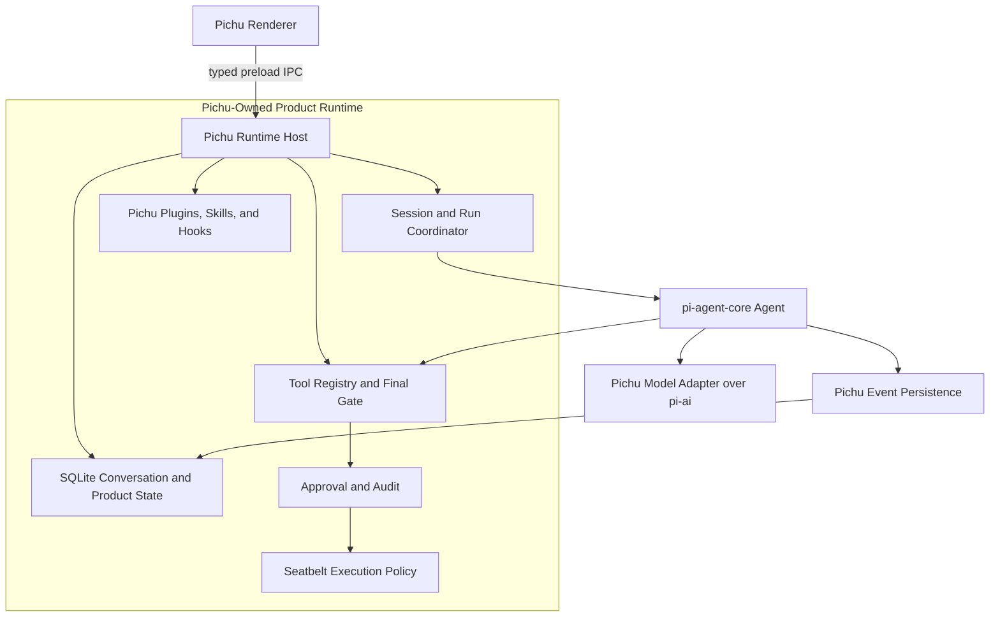

# RFC: Pichu-Owned Codex-Class Agent Runtime

## Status

Draft technical design for internal review.

This RFC replaces the earlier proposal to adopt Pi Coding Agent as Pichu's
runtime and Pi Packages and Extensions as Pichu's ecosystem. Pichu is not building
a desktop client for Pi CLI and does not target compatibility with the Pi CLI
ecosystem.

Existing architecture documents remain authoritative for their owned areas:

- `docs/PLUGIN_SYSTEM.md` for Agent Plugins packages, Pichu client extensions,
  and MCP runtime behavior.
- `docs/CODEX_AGENT_HOOKS.md` for Codex-aligned hook behavior.
- `docs/HUMAN_IN_THE_LOOP.md` for durable human-input continuation.

## Abstract

Pichu should build and own a Codex-class coding-agent runtime. It may use
`@earendil-works/pi-ai` for model/provider integration and
`@earendil-works/pi-agent-core` for the low-level agent loop, messages, tools,
and tool hooks. It should not use Pi CLI or Pi Coding Agent's `AgentSession`,
`AgentSessionRuntime`, `SessionManager`, JSONL persistence, package manager, or
extension runtime as Pichu product contracts.

Pichu remains authoritative for session lifecycle, SQLite conversation history,
context construction, compaction, tools, approvals, macOS Seatbelt, plugins,
skills, multi-agent orchestration, artifacts, search, Electron IPC, and desktop
experience. Codex alignment describes product behavior and security semantics;
it does not require copying Codex internals or adopting a second runtime.

## Decision Summary

1. Pichu owns the coding-agent runtime and its public contracts.
2. Pichu continues to construct `pi-agent-core` `Agent` instances through a
   Pichu-owned runtime factory.
3. `pi-ai` and `pi-agent-core` are implementation libraries, not product
   persistence or extension contracts.
4. Pichu does not adopt `pi-coding-agent` `createAgentSession()`,
   `createAgentSessionRuntime()`, `AgentSession`, or `SessionManager`.
5. SQLite `messages` and `message_parts` remain the authoritative conversation
   store. There is no Pi JSONL conversation store or dual write.
6. Pichu retains its plugin product, but replaces the legacy
   `.open-plugin/plugin.json` package contract with Agent Plugins 1.0. Pichu does
   not support Pi Packages or Pi CLI Extensions.
7. Pichu's final tool gate, approval engine, hooks, audit, and Seatbelt policy
   remain host-owned and apply to every tool source.
8. Existing search, human input, artifacts, session inspection, local RPC,
   Browser, Computer Use, and multi-agent behavior must remain functional. MCP
   becomes a first-class Pichu plugin capability under the same host policy.
9. The `pi-coding-agent` dependency should be removed after the small utility
   imports still used by Pichu are replaced or moved behind Pichu-owned adapters.

## Product Direction

Pichu is an open, desktop-first coding agent with a Codex-class interaction model.
The product should support:

- Multiple concurrent tasks and isolated worktrees.
- Durable sessions that survive renderer and app restarts.
- Streaming conversation, thinking, tool calls, and structured results.
- Global session search and deep links.
- Explicit tool approval, remembered rules, audit, and fail-closed behavior.
- macOS Seatbelt enforcement for commands and filesystem mutation.
- Background terminals and durable command ownership.
- Human-in-the-loop tools and restart-safe continuation.
- Artifacts, attachments, Browser, Computer Use, and other desktop-native tools.
- Multi-agent delegation with explicit parent, child, and run relationships.
- Agent Plugins, skills, Pichu hooks, MCP servers, and future app connectors.

These capabilities should feel comparable to Codex while remaining Pichu-owned.
Pichu does not need to reproduce private Codex protocols, storage formats, or
implementation details.

## Goals

- Preserve one coherent Pichu runtime instead of combining Pichu and Pi Coding
  Agent lifecycle models.
- Keep SQLite as the durable source of truth for conversation and product data.
- Centralize all agent construction so the same policy applies to main agents,
  side conversations, continuations, automations, and subagents.
- Maintain a stable typed boundary around `pi-ai` and `pi-agent-core` so Pichu can
  upgrade or replace them without changing renderer or persistence contracts.
- Make tool execution interceptable, approvable, auditable, and enforceable at
  the OS boundary.
- Adopt Agent Plugins 1.0 for portable skills and MCP while keeping Pichu hooks
  and product policy in the `com.pichu.app` client extension.
- Protect current functionality throughout the refactor.

## Non-Goals

- Do not build a GUI wrapper for Pi CLI.
- Do not run the `pi` CLI in RPC mode as the production agent runtime.
- Do not target drop-in compatibility with Pi Extensions or Pi Packages.
- Do not use Pi `AgentSession` or `SessionManager` for conversation lifecycle.
- Do not introduce JSONL as a second conversation store.
- Do not delete or migrate SQLite messages as part of this direction.
- Do not delete the Pichu plugin product, installation state, Marketplace, or
  plugin data as part of this direction.
- Do not reproduce Codex internals that are not needed for observable product
  behavior.
- Do not load untrusted plugin code into Electron main without an explicit
  capability and isolation design.
- Do not introduce runtime configuration through environment variables.

## Terminology

| Term | Definition |
| --- | --- |
| Pichu runtime | Pichu-owned orchestration around agent construction, sessions, prompts, context, tools, continuations, persistence, and lifecycle. |
| Agent core | The low-level `pi-agent-core` `Agent` loop used as an implementation library. |
| Model layer | `pi-ai` model types, providers, streaming, and related adapters. |
| Codex-class | Product behavior comparable to Codex in task management, safety, coding tools, persistence, and desktop workflow. |
| Pichu plugin | An Agent Plugins package loaded by Pichu, optionally containing the `com.pichu.app` client extension; it is not a Pi Package or Pi CLI Extension. |
| Final tool gate | The last non-overridable Pichu policy step after all allowed input transformations and before tool execution. |
| Conversation store | SQLite `messages` and `message_parts`, which are authoritative for restore and replay. |

## Current Baseline

Pichu already follows much of the target direction:

| Area | Current owner | Target |
| --- | --- | --- |
| Agent loop | `pi-agent-core` `Agent` constructed in Pichu | Keep, behind a centralized Pichu runtime factory |
| Model streaming | Pichu adapters over `pi-ai` | Keep behind typed Pichu model interfaces |
| Conversation history | SQLite `messages` and `message_parts` | Keep authoritative |
| Session metadata | SQLite `sessions` | Keep authoritative |
| Global search | SQLite FTS over sessions and messages | Keep |
| Tool approval | Pichu approval engine | Keep and strengthen as final host gate |
| Shell sandbox | Pichu Seatbelt integration | Keep and expand coverage |
| Hooks | Pichu Codex-aligned hook runtime | Keep |
| Plugins | Legacy Pichu manifest, registry, installer, skills, and hooks | Adopt Agent Plugins 1.0 packaging; retain Pichu installation and policy; add MCP |
| Human input | SQLite request state plus continuation | Keep |
| Artifacts | Pichu artifact store linked to messages | Keep |
| Multi-agent | Pichu team manager and tools | Keep, unify under the runtime factory |

The current application imports a few helpers and tool types from
`pi-coding-agent`. Those imports do not require adopting its session or
extension runtime. They should be inventoried and replaced with Pichu-owned
adapters or equivalent core-level utilities before removing the dependency.

## Target Architecture



Electron main may initially continue hosting the coordinator. Long-running or
untrusted execution can move to a utility process or sandboxed helper through a
separate isolation project. That process boundary must not change the renderer,
SQLite, approval, or tool contracts.

## Dependency Boundaries

### `pi-ai`

Pichu may use `pi-ai` for:

- Model and provider types.
- Streaming response primitives.
- Provider capability metadata.
- Usage and token accounting inputs.

Pichu should wrap provider selection, authentication, model settings, fallback,
and message conversion behind Pichu-owned interfaces. Renderer IPC and SQLite
rows must not expose dependency-specific objects.

### `pi-agent-core`

Pichu may use `pi-agent-core` for:

- The `Agent` loop.
- Agent messages and streaming events.
- Tool definitions and execution callbacks.
- `beforeToolCall` and `afterToolCall` interception.
- Steering, follow-up, abort, and continuation primitives that Pichu explicitly
  adopts.

Pichu owns the configuration passed to `Agent`, the lifecycle around it, and the
interpretation and persistence of emitted events.

### `pi-coding-agent`

Pichu does not use these as product contracts:

- `createAgentSession()`.
- `createAgentSessionRuntime()` or `AgentSessionRuntime`.
- `AgentSession`.
- `SessionManager` or Pi JSONL sessions.
- `DefaultResourceLoader`.
- `DefaultPackageManager`.
- Pi Extensions, extension commands, or extension UI.
- Pi Package discovery and installation.

Temporary imports of isolated helpers do not imply runtime adoption. Each must
be replaced, copied only when licensing and maintenance allow it, or moved to a
small adapter with focused tests. The end state should not require
`pi-coding-agent` at runtime.

## Pichu Runtime Contract

### Central Agent Factory

All agent construction should move behind one Pichu-owned factory:

```ts
type CreatePichuAgentRuntimeOptions = {
  sessionId: string
  runId: string
  cwd: string
  source: 'chat' | 'automation' | 'continuation' | 'subagent'
  model: PichuModelConfig
  initialMessages: AgentMessage[]
  tools: PichuToolDefinition[]
}

type PichuAgentRuntime = {
  prompt(input: PichuPromptInput): Promise<PichuRunResult>
  steer(input: PichuPromptInput): Promise<void>
  followUp(input: PichuPromptInput): Promise<void>
  abort(): Promise<void>
  dispose(): Promise<void>
}
```

The exact types may differ, but callers must not construct `Agent` directly.
The factory installs the same model conversion, persistence, hook, approval,
audit, tool, compaction, and cleanup behavior for every run source.

### Runtime State

In-memory state is scoped to an active run. Durable state is written through
named stores and transactions. A renderer reload or app restart must be able to
reconstruct an agent from SQLite without relying on an in-memory `Agent`.

Runtime state should distinguish:

- Idle session.
- Active run.
- Waiting for tool approval.
- Waiting for human input.
- Aborting.
- Interrupted or failed.
- Completed.

These states should be closed typed variants rather than loosely correlated
booleans.

### Prompt and Continuation

The coordinator owns:

- User prompt validation and persistence.
- Skill expansion and developer context.
- Session-start and prompt hooks.
- Agent invocation and streaming event routing.
- Tool-approval continuation.
- Human-input continuation.
- Stop hooks and bounded continuation.
- Run completion, interruption, and cleanup.

Continuations must use the same runtime factory and tool gate as normal prompts.

## Conversation Persistence

### SQLite Is Authoritative

SQLite remains the source of truth for:

- User, assistant, tool-call, and tool-result messages.
- Structured message parts and attachments.
- Message visibility and deterministic ordering.
- Session restore and model replay.
- Pending and completed deferred tool results.
- Search snippets and deep links.
- Artifact source-message relationships.

`messages` and `message_parts` must not be dropped. No migration to Pi JSONL is
planned.

### Event Persistence

Pichu subscribes to `Agent` events and persists normalized results through the
existing event-persistence boundary. The persistence layer must remain:

- Idempotent for retried or replayed terminal events.
- Deterministic in message and part ordering.
- Transactional where a tool result resolves approval or human-input state.
- Compatible with incomplete tool calls during restart recovery.
- Independent from renderer lifetime.

### Search

Current SQLite search remains a first-class product capability. It should
continue searching:

- Session title and working directory.
- Visible message content.
- Tool names and tool results.
- Main, non-archived sessions under the current filtering contract.

Any schema evolution must preserve snippets, highlights, result ordering, and
message deep links. Search does not need a projection from another conversation
store because SQLite remains authoritative.

### Compaction

Pichu owns context compaction. Compaction may generate summaries or derived
context, but it must not destroy the durable transcript or cross unresolved
approval and human-input boundaries. The model-facing context can differ from
the user-visible transcript when visibility metadata explicitly permits it.

## Tool Runtime, Approval, and Seatbelt

### Final Tool Lifecycle

The required order is:

```text
model tool call
  -> normalize tool identity
  -> Pichu PreToolUse hooks
  -> apply allowed input updates
  -> final schema validation
  -> Pichu permission classification
  -> approval UI or remembered policy
  -> one-time Seatbelt grant
  -> tool execution
  -> Pichu audit and durable result
  -> Pichu PostToolUse hooks
  -> model-facing result
```

The final validation, permission, and execution boundary is owned by Pichu. A
plugin hook may block, request approval, or propose an allowed input update, but
it cannot remove or reorder the final gate.

### Coverage

The gate must cover:

- `exec_command` and background commands.
- `write_stdin` ownership of an existing command.
- Read, edit, write, and patch tools.
- Browser and Computer Use.
- Web, image, artifact, cron, and workbench tools.
- Agent Plugin MCP tools.
- Plugin-provided tools when introduced.
- Main agents, continuations, automations, and subagents.

### Seatbelt

Approval expresses user intent; Seatbelt enforces OS capabilities. Grants must
remain bound to finalized input, session, run, tool call, cwd, expiry, and
one-time consumption. Permanent sensitive-path denies remain stronger than a
temporary approval.

Long-running processes retain the sandbox assigned at creation. `write_stdin`
does not create a new sandbox grant. File mutations that occur in Electron main
need an equivalent sandboxed helper or a strict host capability boundary.

## Plugins, Skills, Hooks, and MCP

Pichu adopts [Agent Plugins 1.0](https://agent-plugins.org/specification) as the
portable plugin package contract. A package has root `plugin.json`, optional
Agent Skills under `skills/`, and optional MCP configuration at root
`mcp.json`. `docs/PLUGIN_SYSTEM.md` defines the complete Pichu client behavior.

Pichu continues to own installation, Marketplace, enablement, updates, trust,
permissions, sandboxing, authentication, diagnostics, and UI. These concerns
do not become portable manifest fields.

Pichu-specific declarative behavior uses `extensions.com.pichu.app` or files
under `com.pichu.app/`. Codex-aligned hooks move into that namespace and
continue to run under Pichu-owned execution and audit.

MCP is a first-class runtime capability. Pichu supports stdio and Streamable HTTP
servers, maps their tools into deterministic Pichu tool identities, and routes
every call through hooks, final schema validation, approval, audit, and
Seatbelt policy. One server failure must not disable sibling servers or skills.

Pi Packages and Pi CLI Extensions are not compatibility targets. Agent Plugins
client extensions are portable namespaced data, not executable Pi extensions.

## Renderer and IPC

The renderer consumes Pichu-owned typed APIs. It must not receive `Agent`,
provider objects, raw database access, generic plugin registry operations, or
filesystem primitives.

The existing namespaces may evolve, but must continue to cover:

- Sessions, messages, search, and streaming events.
- Prompt, steer, follow-up, abort, and resume.
- Tool approvals and human-input requests.
- Plugins, skills, MCP servers, settings, artifacts, and diagnostics.
- Background command status and ownership.

Every event subscription must return an unsubscribe function. IPC payloads must
be validated in main and use stable failure shapes.

## Multi-Agent Direction

Multi-agent behavior is a Pichu runtime capability, not a Pi Extension feature.
The team manager should create child agents through the same central factory and
record:

- Parent session and parent run.
- Child agent identity and role.
- Working directory or worktree ownership.
- Delegated prompt and lifecycle state.
- Tool approvals and audit under the child identity.
- Result delivery and cancellation.

Subagents must not bypass tool policy or acquire broader filesystem access than
their parent unless the user explicitly approves it.

## Compatibility and Data Policy

This direction requires no destructive message migration. Existing sessions,
search indexes, plugin installation state, approvals, human-input requests, and
artifacts remain readable.

Schema changes still require normal forward Drizzle migrations. A future data
model change must include explicit compatibility handling for persisted user
data; it must not infer permission to delete data from this RFC.

The runtime refactor should preserve current model-facing transcript behavior.
Where a deliberate semantic change is necessary, it must be named, tested, and
reviewed independently.

## Rollout Plan

### Phase 0: Freeze the Product Contracts

- Inventory all direct `new Agent(...)` construction sites.
- Inventory all `pi-coding-agent` imports and classify them as tool helper,
  parser, type, or runtime dependency.
- Record current session, search, approval, Seatbelt, human-input, artifact,
  plugin, and multi-agent behavior in focused tests.
- Inventory legacy plugin manifests and MCP-capable components against Agent
  Plugins 1.0 and the `com.pichu.app` namespace.
- Define the stable Pichu runtime and IPC contracts.

### Phase 1: Centralize Agent Construction

- Introduce the Pichu runtime factory.
- Migrate chat, detached prompt, continuation, automation, admin, and subagent
  callers to it.
- Install persistence, hooks, approval, audit, and cleanup once in the factory.
- Preserve existing SQLite rows and renderer behavior.

### Phase 2: Harden Tool Execution

- Make final schema validation explicit after hook input updates.
- Prove that every registered tool crosses the final gate.
- Bind approval decisions and Seatbelt grants to finalized tool inputs.
- Add fail-closed coverage for renderer, agent, and host-process failure.
- Move OS-sensitive mutations behind enforceable execution boundaries.

### Phase 3: Remove Pi Coding Agent Coupling

- Replace coding-tool helpers with Pichu-owned adapters over core or local
  implementations.
- Replace isolated parser or type imports.
- Remove `@earendil-works/pi-coding-agent` from runtime bundling and dependencies
  when no imports remain.
- Keep `pi-ai` and `pi-agent-core` pinned and tested behind adapters.

### Phase 4: Codex-Class Product Expansion

- Improve task and worktree isolation.
- Unify background command and terminal ownership.
- Strengthen multi-agent lifecycle and visibility.
- Complete the Agent Plugins MCP runtime and add future connectors through
  separate Pichu-owned contracts.
- Improve session inspection, search, artifacts, and recovery without changing
  the authoritative conversation store.

## Release Gate

The refactor must not ship with regressions in these capabilities:

| Capability | Required acceptance |
| --- | --- |
| Conversation | User, assistant, thinking, tool, attachment, visibility, ordering, streaming, abort, and resume preserve the current contract |
| Persistence | Existing SQLite sessions restore without conversion and incomplete tool calls remain recoverable |
| Search | Title, cwd, visible messages, tool names/results, snippets, highlights, filters, ranking, and deep links work |
| Approval | Every tool source is covered; ask, allow, deny, cancellation, remembered rules, and missing UI behave correctly |
| Seatbelt | Input-bound one-time grants, permanent denies, background children, expiry, and `write_stdin` ownership pass tests |
| Human input | Request, response, cancellation, restart, atomic resolution, and continuation work |
| Artifacts | Creation, source-message navigation, export, and deletion retain current behavior |
| Plugins and MCP | Agent Plugins validation, install, enable, skills, Pichu hooks, MCP lifecycle, auth, diagnostics, final-gate coverage, and UI work |
| Multi-agent | Parent/child identity, cancellation, tool policy, result delivery, and cleanup work |
| Native tools | Browser, Computer Use, web, image, cron, and workbench tools retain model-facing contracts |

A failed parity case blocks the runtime cutover. Tests may use existing SQLite
data and Pichu Plugins because both remain supported product contracts.

## Verification Strategy

### Runtime

- Central factory coverage test for every agent source.
- Prompt, steering, follow-up, abort, continuation, and disposal tests.
- Event ordering and idempotent persistence tests.
- Context conversion, visibility, and compaction tests.
- Dependency-adapter tests around `pi-ai` and `pi-agent-core` upgrades.

### Persistence and Recovery

- Restore existing SQLite sessions without migration.
- Restore pending tool approval and human-input states.
- Restart during streaming, tool execution, and background command execution.
- Verify message-part ordering, attachments, artifacts, and search indexes.
- Verify transactions cannot leave a resolved tool with unresolved durable state.

### Security

- PreToolUse input updates are revalidated.
- Every tool source crosses the final gate.
- Approval and grant correlation mismatches fail closed.
- Sensitive-path denies remain effective after user approval.
- Subagents and plugins cannot bypass host policy.
- IPC does not expose generic shell, filesystem, database, Keychain, or plugin
  registry primitives.

### Plugins

- Continue running `pnpm --filter pichu-client test:plugins` for plugin changes.
- Validate Agent Plugins manifests, fixed component locations, schema versions,
  paths, skills, MCP entries, Pichu hooks, and install state.
- Verify disabled plugins contribute no active runtime capabilities.
- Verify stdio and Streamable HTTP server lifecycle and failure isolation.
- Verify MCP tools cannot bypass approval, audit, and Seatbelt.

## Observability

Record privacy-safe structured events for:

- Runtime creation, source, readiness, interruption, disposal, and failure.
- Prompt, continuation, compaction, and recovery outcomes.
- Tool-gate decisions, approval correlation, and Seatbelt grants.
- Persistence failures and transaction rollback categories.
- Plugin and hook load or execution diagnostics.
- Multi-agent creation, result delivery, cancellation, and cleanup.

Do not log prompt content, credentials, cookies, auth headers, private file
contents, full tool payloads, or unnecessary absolute paths.

## Alternatives Considered

### Adopt Pi Coding Agent and Pi CLI Ecosystem

Rejected. It provides a mature `AgentSession`, JSONL sessions, Packages, and
Extensions, but it gives Pichu a second lifecycle, persistence model, extension
contract, and UI compatibility problem. Pichu's goal is a Codex-class product,
not a desktop client for Pi CLI.

### Use Pi CLI RPC as the Runtime

Rejected for production. RPC is useful for experiments and isolation, but it
makes Pichu a client of Pi CLI behavior and weakens control over persistence,
approval, tools, recovery, and product-specific lifecycle.

### Use Pi AgentSession but Mirror Messages to SQLite

Rejected. JSONL and SQLite would become competing authorities, creating ordering,
recovery, branch, and partial-failure ambiguity. It would also retain Pi Coding
Agent runtime coupling without making its ecosystem a product goal.

### Implement a SQLite SessionManager for Pi Coding Agent

Rejected. Matching Pi's evolving branch, compaction, label, custom-entry, and
extension semantics would recreate a large compatibility layer that Pichu does
not need.

### Remove All Pi Libraries

Not required. `pi-ai` and `pi-agent-core` already provide useful lower-level
model and loop primitives. Keeping them behind Pichu-owned adapters avoids
rewriting commodity infrastructure while preserving product ownership.

## Open Questions

- Which current `pi-coding-agent` helper imports should be replaced locally and
  which should move into `pi-agent-core` upstream?
- Should the central Pichu runtime remain in Electron main initially or move to a
  utility process once its typed boundary is complete?
- Which observable Codex behaviors are release requirements versus later
  product improvements?
- What is the minimal typed capability contract for future non-MCP connectors?
- How should subagent worktree and approval inheritance be represented in
  SQLite?

These questions do not change the core decision: Pichu owns the Codex-class
coding-agent runtime and SQLite conversation model; Pi supplies lower-level
model and agent-loop libraries only.
